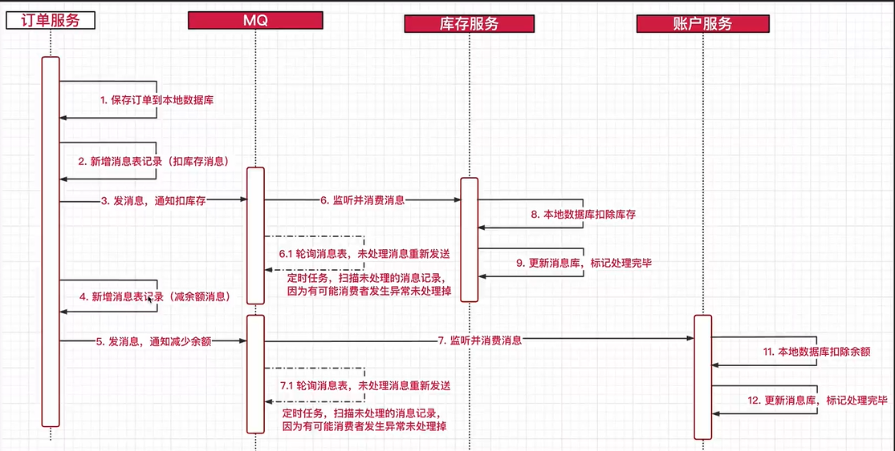

1, 发送短信的逻辑
2， 保存验证码到redis中

# 3,Feign的使用
- Feign进行调用条件 参考hire-api/com/imooc/feign/README.md
- Feign调用的问题

电商事务场景
订单服务(创建订单)->库存服务(扣除库存)->账户服务(扣款)
当扣款失败以后可能库存服务以及订单服务都已经完成,`不会进行回滚`

- 测试：com/imooc/controller/PassportController.java 中login

解决办法：
- 2PC 需要增加一个协调者协调不同事务,缺点创建协调者开销比较大
- TCC 协调者(步骤：1，try 比如try库存,不够就会知道会有错误,2,confirm不同的服务,3,cancel 都是手动)

使用消息队列：
最大努力通知：自己平台调用第三方SDK，第三方会多次发出通知，自己平台处理通知，使用消息队列
最终一致性：

如果一个失败：
消息恢复以后还是可以得到消息，未处理消息的重新发送

# 4.Seata已经可以处理这些事务了

- TC：协调全局
- TM：开启全局事务提交回滚，
- RM：资源管理器：管理事务，与TC交流，分支事务的提高回滚

在微服务中，一个业务操作往往涉及多个服务（如订单、库存、账户等），传统的数据库事务（如本地事务）无法跨服务生效。
Seata 可以做到 一个全局事务管理多个服务的本地事务，实现`要么都成功，要么都失败`。
而且 开发者几乎不用更改业务代码，只需要在入口方法加 `@GlobalTransactional` 即可。

| 模式      | 说明                            | 特点           |
| ------- | ----------------------------- | ------------ |
| AT 模式   | 自动代理本地事务，回滚靠 undo\_log 表      | 零侵入、适合传统应用   |
| TCC 模式  | 手动定义 Try/Confirm/Cancel 三阶段方法 | 控制更细、适合强一致场景 |
| SAGA 模式 | 长事务，定义补偿逻辑                    | 适合不需要强一致的业务  |

